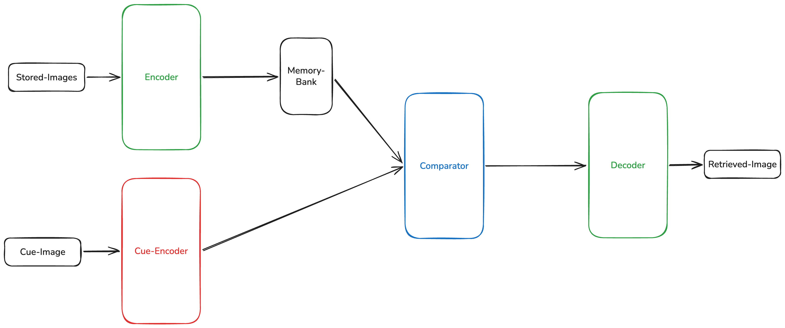
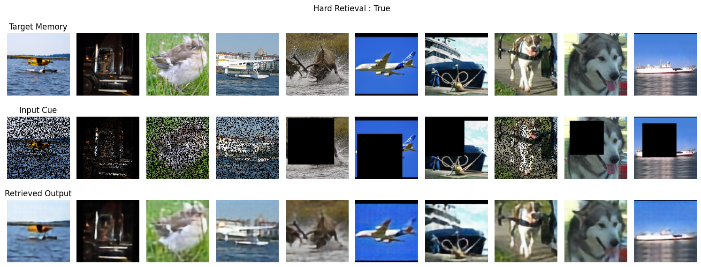
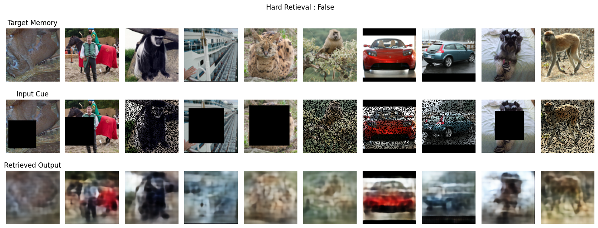
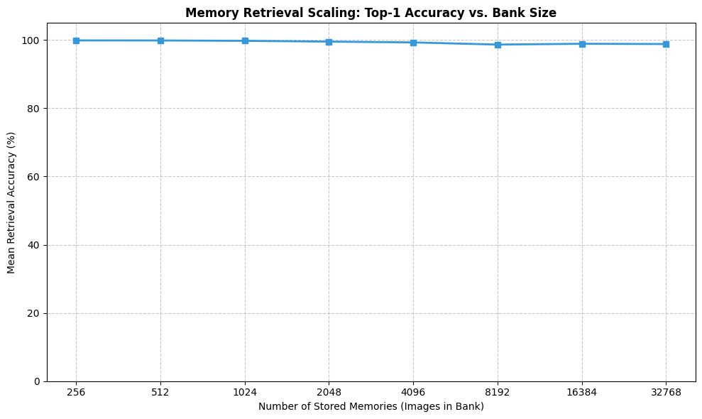

# Introduction
This project implements a Neural Associative Memory system designed to "store" images in a compressed latent space and "retrieve" them when presented with partial or corrupted information. Unlike a standard database that looks up files by a specific name or index, this system uses Content-Addressable Memory, meaning it uses the visual features of a "cue" to find and reconstruct the original image from its internal storage.

   

# Why this project matters

## Beyond Parametric Memory
Most current models (including LLMs) rely on Parametric Memory—knowledge baked into the weights of the model during training. This project implements Non-Parametric Memory, where the model learns how to access a database of information rather than just memorizing it. This allows the system to:
* Scale its knowledge without retraining the entire core network.
* Update its "worldview" simply by swapping out the contents of the memory bank.

## LLM integration
The most exciting aspect of this project is its role as a precursor to Augmented Language Models.
Current LLMs have a "context window" limit—they can only remember what is currently in their immediate prompt. By developing this image-based associative memory, we build the logic for a RAG-like system at a fundamental neural level. By fine-tuning an LLM to use an external memory bank and to retrieve a memory by quering the memory bank by providing a partial cue, we can improve the LLM's long context memory and even make memories persist across different contexts.

## Others
* This can also kinda be used as a classifier. If you store enough examples of a class in the memory bank (see below), we can use the comparator (see below) to match a new image to predict its class. This was not tested, just a theoretical idea.

   

# Architecture 
The model was inspired by both traditional Random Acess Memory (RAM) and the hippocampus's Context Addressable Memory (CAM).
Below is a picture showing the model's architecture.

## Encoder-Decoder
The Encoder is a series of convolutional layers designed for Dimensionality Reduction.
* Input: A raw image (32x32 for cifar, 96x96 for stl-10).
* Output: A Latent Vector.

All images which are stored in the memory bank are passed through this encoder and the latent vectors of the images are stored.

The Decoder is the projector of the latent vectors.
* Input: A latent vector of an image which was encoded by the Encoder.
* Output: A fully reconstructed image.

The Encoder-Decoder pair are to be trained together, the target being fully reconstructing the image passed onto the encoder.

## Cue-Encoder
Cue-Encoder is trained to handle the cue (the query).

During its training phase, the Cue-Encoder is trained along with a temporary partner, the Cue-Decoder. This pair presented with images that have been heavily corrupted using random pixel erasure or block masking (between 25% and 60% of the image is removed).

The cue-encoder and the cue-decoder only see the corrupted image and try to reconstruct that same corrupted image as accurately as possible. The cue-encoder learns to capture the essence of the cue. It doesn't try to hallucinate the original image.

## Comparator
This is where the magic happens. The comparator's objective is to match the latent-cue from the cue-encoder of a corrupted image and match it with the latent vectors stored in the Memory-Bank. To find the correct memory, the Comparator utilizes Multi-Head Attention, with query being the latent-cue, keys and values both being the latent vectors in the memory bank. It outputs a latent-vector which is then passed on to the Decoder to reconstruct the full image.

The comparator has 2 modes:
* Hard Retrieval: The strongest similar memory is chosen as is from the memory bank.
* Soft Retrieval: All the memories in the memory bank are combined together by a weighted sum based on similarity scores.

   

# Training
The models are trained in a decoupled, three-stage process:
* Stage 1: We train the Encoder-Decoder pair on clean images. This ensures the latent space can effectively represent and reconstruct the dataset's features.
* Stage 2: We train the Cue-Encoder to reconstruct corrupted inputs. By focusing only on the "signal" within the noise, the Cue-Encoder learns to map partial information to a stable latent point without being distracted by missing pixels.
* Stage 3: We freeze the encoders and train the Comparator. Using a Cross-Entropy loss on retrieval accuracy and MSE loss on the latents, the model learns to use Multi-Head Attention to "pick" the correct memory from the bank.

   

# Examples: STL-10

## Hard Retrieval on a bank of size 256

That malamute looks so cute awwww

## Soft Retrieval on a bank of size 256

You might want to change the value in the comparator's mlp layer in STL-10 from 512 to something larger like 4096 for better soft retrieval (I'm stupid).

## Accuracy Scores (avged on 10 runs)
